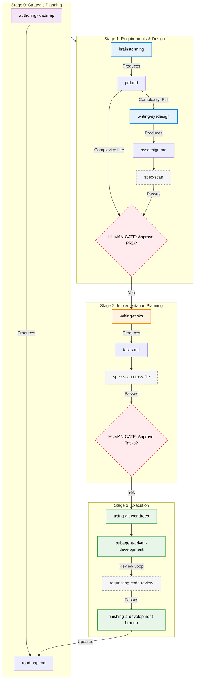

# Superpowers

Superpowers is a complete software development workflow for your coding agents, built on top of a set of composable "skills" and some initial instructions that make sure your agent uses them.

## How it works

It starts from the moment you fire up your coding agent. As soon as it sees that you're building something, it *doesn't* just jump into trying to write code. Instead, it steps back and asks you what you're really trying to do. 

Once it's teased a spec out of the conversation, it shows it to you in chunks short enough to actually read and digest. 

After you've signed off on the design, your agent puts together an implementation plan that's clear enough for an enthusiastic junior engineer with poor taste, no judgement, no project context, and an aversion to testing to follow. It emphasizes true red/green TDD, YAGNI (You Aren't Gonna Need It), and DRY. 

Next up, once you say "go", it launches a *subagent-driven-development* process, having agents work through each engineering task, inspecting and reviewing their work, and continuing forward. It's not uncommon for Claude to be able to work autonomously for a couple hours at a time without deviating from the plan you put together.

There's a bunch more to it, but that's the core of the system. And because the skills trigger automatically, you don't need to do anything special. Your coding agent just has Superpowers.


## Sponsorship

If Superpowers has helped you do stuff that makes money and you are so inclined, I'd greatly appreciate it if you'd consider [sponsoring my opensource work](https://github.com/sponsors/obra).

Thanks! 

- Jesse


## Installation

**Note:** Installation differs by platform. Claude Code or Cursor have built-in plugin marketplaces. Codex and OpenCode require manual setup.

### Claude Code Official Marketplace

Superpowers is available via the [official Claude plugin marketplace](https://claude.com/plugins/superpowers)

Install the plugin from Claude marketplace:

```bash
/plugin install superpowers@claude-plugins-official
```

### Claude Code (via Plugin Marketplace)

In Claude Code, register the marketplace first:

```bash
/plugin marketplace add obra/superpowers-marketplace
```

Then install the plugin from this marketplace:

```bash
/plugin install superpowers@superpowers-marketplace
```

### Cursor (via Plugin Marketplace)

In Cursor Agent chat, install from marketplace:

```text
/add-plugin harnesssuperpowers
```

or search for "superpowers" in the plugin marketplace.

### Codex

Tell Codex:

```
Fetch and follow instructions from https://raw.githubusercontent.com/obra/superpowers/refs/heads/main/.codex/INSTALL.md
```

**Detailed docs:** [docs/README.codex.md](docs/README.codex.md)

### OpenCode

Tell OpenCode:

```
Fetch and follow instructions from https://raw.githubusercontent.com/obra/superpowers/refs/heads/main/.opencode/INSTALL.md
```

**Detailed docs:** [docs/README.opencode.md](docs/README.opencode.md)

### GitHub Copilot CLI

```bash
copilot plugin marketplace add obra/superpowers-marketplace
copilot plugin install superpowers@superpowers-marketplace
```

### Gemini CLI

```bash
gemini extensions install https://github.com/obra/superpowers
```

To update:

```bash
gemini extensions update superpowers
```

### Verify Installation

Start a new session in your chosen platform and ask for something that should trigger a skill (for example, "help me plan this feature" or "let's debug this issue"). The agent should automatically invoke the relevant superpowers skill.

### New Project Quickstart

In a brand-new project workspace:

1. Invoke `getting-started` to bootstrap Layer 2 (`docs/superpowers/`) and run one full workflow loop.
2. (Optional, Cursor) Enable hooks via project `.cursor/hooks.json` or user `%USERPROFILE%/.cursor/hooks.json` so session reminders (spec-scan / capture-knowhow) are injected automatically. If hooks injection is unreliable in your Cursor build, use the always-on rules fallback: `.cursor/rules/harnesssuperpowers-reminders.mdc` (with `alwaysApply: true` frontmatter).

## The Spec-Driven Development Pipeline

The Superpowers framework uses a structured **Wave → Phase → Stage** hierarchy to manage complexity. The workflow progresses through four strict Stages (0 to 3) for each Phase:



### Stage 0: Strategic Planning
1. **authoring-roadmap** - Creates and maintains the top-level project `roadmap.md` using the Wave → Phase hierarchy.

### Stage 1: Requirements & Design
2. **brainstorming** - Refines rough ideas into a formal PRD (`prd.md`). Recommends if the Phase is "Lite" or "Full".
3. **writing-sysdesign** (Full Phases only) - Creates system architecture, Interface Contracts, and Correctness Properties (`sysdesign.md`).
4. **spec-scan** - Automatically validates the SysDesign for compliance and cross-file consistency.

### Stage 2: Implementation Planning
5. **writing-tasks** - Breaks the approved design into bite-sized implementation tasks (2-5 mins each) with clear verification steps (`tasks.md`).
6. **spec-scan** - Validates tasks against the PRD and SysDesign.

### Stage 3: Execution
7. **using-git-worktrees** - Creates an isolated workspace and branch for implementation (run *after* design is complete).
8. **subagent-driven-development** - Dispatches fresh subagents per task with a two-stage review process (spec compliance, then code quality).
9. **requesting-code-review** - Used between tasks to ensure code quality and plan adherence.
10. **finishing-a-development-branch** - Merges code, cleans up worktree, and automatically marks the Phase as Done in the roadmap.

*(Optional at any point)* **capturing-knowhow** - Persist session learnings into the project's KnowHow base to avoid repeating mistakes.

**The agent checks for relevant skills before any task.** Mandatory workflows, not suggestions.

## What's Inside

### Skills Library

**Testing**
- **test-driven-development** - RED-GREEN-REFACTOR cycle (includes testing anti-patterns reference)

**Debugging**
- **systematic-debugging** - 4-phase root cause process (includes root-cause-tracing, defense-in-depth, condition-based-waiting techniques)
- **verification-before-completion** - Ensure it's actually fixed

**Collaboration & Planning** 
- **authoring-roadmap** - Strategic Wave/Phase roadmap planning
- **brainstorming** - Socratic design refinement to produce PRD
- **writing-tasks** - Detailed implementation plans from specs
- **executing-plans** - Batch execution with checkpoints
- **dispatching-parallel-agents** - Concurrent subagent workflows
- **requesting-code-review** - Pre-review checklist
- **receiving-code-review** - Responding to feedback
- **using-git-worktrees** - Parallel development branches
- **finishing-a-development-branch** - Merge/PR decision workflow
- **subagent-driven-development** - Fast iteration with two-stage review
- **next-session-handover** - Generate context-rich handovers for future sessions

**Harness Engineering & Spec-Driven Development**
- **harness-engineering** - Periodic diagnostic tool (Feedforward, Feedback, Wiring Matrix, Flywheel)
- **writing-sysdesign** - Architecture and design flow producing CP-xx and Interface Contracts
- **spec-scan** - Automated compliance and cross-file consistency checker for Phase documents
- **capturing-knowhow** - Capture session learnings into a project KnowHow base
- **bootstrapping-harness** - Scaffold a project's Layer 2 harness extension (`docs/superpowers/`)

**Meta**
- **writing-skills** - Create new skills following best practices (includes testing methodology)
- **using-superpowers** - Introduction to the skills system

### Extending into Your Project

This plugin ships generic core skills; your project grows a Layer 2 extension (`docs/superpowers/`) and optional Layer 3 evaluators. See [`docs/harness-extension-guide.md`](docs/harness-extension-guide.md) for the scaffolding procedure.

## Philosophy

- **Test-Driven Development** - Write tests first, always
- **Systematic over ad-hoc** - Process over guessing
- **Complexity reduction** - Simplicity as primary goal
- **Evidence over claims** - Verify before declaring success

Read more: [Superpowers for Claude Code](https://blog.fsck.com/2025/10/09/superpowers/)

## Contributing

Skills live directly in this repository. To contribute:

1. Fork the repository
2. Create a branch for your skill
3. Follow the `writing-skills` skill for creating and testing new skills
4. Submit a PR

See `skills/writing-skills/SKILL.md` for the complete guide.

## Updating

Skills update automatically when you update the plugin:

```bash
/plugin update superpowers
```

## License

MIT License - see LICENSE file for details

## Community

Superpowers is built by [Jesse Vincent](https://blog.fsck.com) and the rest of the folks at [Prime Radiant](https://primeradiant.com).

- **Discord**: [Join us](https://discord.gg/Jd8Vphy9jq) for community support, questions, and sharing what you're building with Superpowers
- **Issues**: https://github.com/obra/superpowers/issues
- **Release announcements**: [Sign up](https://primeradiant.com/superpowers/) to get notified about new versions
