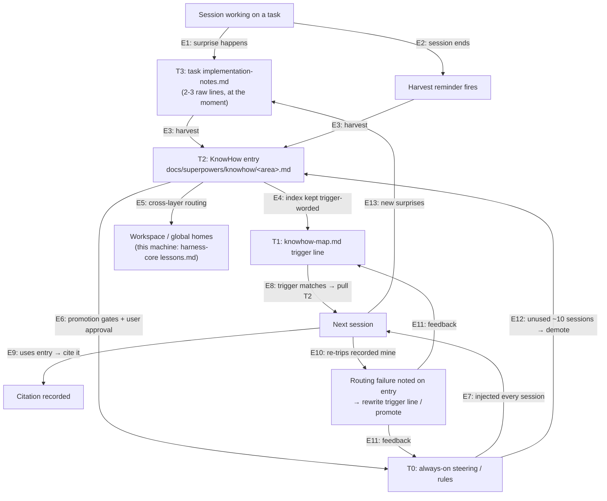

# Loopness Map — the self-reinforcing loop, edge by edge

> **Who reads this, when:** anyone auditing whether the flywheel actually closes — every edge below names the real file or hook that carries it. If an edge's carrier is missing or its content no longer matches, the loop is broken at that edge. Verified 2026-07-04.

## The loop

## Edge → carrier (every carrier must exist)

| Edge | What flows | Carrier file(s) / hook(s) |
|---|---|---|
| E1 | Surprise → raw note at the moment | `skills/capturing-knowhow/SKILL.md` (§ Capture at the Moment of Surprise); `skills/executing-plans/SKILL.md` (Step 2, item 6); `skills/subagent-driven-development/implementer-prompt.md` (Report Format, Deviations line) |
| E2 | Session end → reminder | Claude Code: `hooks/hooks.json` (Stop) → `hooks/capture-knowhow-reminder`; Cursor: `hooks/hooks-cursor.json` (stop) + `.cursor/rules/harnesssuperpowers-reminders.mdc` (§ Session-end reminder, fallback); Kiro: `.kiro/hooks/knowhow-sync.kiro.hook` (agentStop) + `.kiro/steering/knowhow-sync-rules.md` |
| E3 | Notes → numbered T2 entry | `skills/capturing-knowhow/SKILL.md` (§ The Capture Procedure) |
| E4 | Entry → trigger-worded index line | `skills/capturing-knowhow/SKILL.md` (§ The Map); `skills/bootstrapping-harness/templates/knowhow-map.md` |
| E5 | Lesson → right layer's home | `skills/capturing-knowhow/SKILL.md` (Procedure step 0); `docs/knowhow-promotion-protocol.md` (§ Knowledge homes); this machine: `E:\project\AI\harness-core\lessons.md` + `maintenance.md` §3 |
| E6 | Entry → always-on rule (gated) | `docs/knowhow-promotion-protocol.md` (§ Promotion gates) — targets: `.kiro/steering/*.md`, `.cursor/rules/*.mdc`, session-start-injected content |
| E7 | Always-on → next session context | Claude Code: `hooks/hooks.json` (SessionStart) → `hooks/session-start`; Cursor: `hooks/hooks-cursor.json` (sessionStart) + `alwaysApply` rules; Kiro: `.kiro/steering/` (`inclusion: always`); parity governed by `docs/platform-consistency.md` |
| E8 | Trigger line → on-demand pull of T2 | `docs/superpowers/knowhow-map.md` of the target project (trigger wording per E4) |
| E9 | Usage → citation (read-rate proxy) | `docs/knowhow-promotion-protocol.md` (§ Citation discipline) |
| E10–E11 | Re-tripped mine → routing-failure note → index/promotion feedback | `docs/knowhow-promotion-protocol.md` (§ Citation discipline and routing failures) |
| E12 | Stale always-on rule → demotion | `docs/knowhow-promotion-protocol.md` (§ Demotion and pruning); audited by `skills/harness-engineering/SKILL.md` |
| E13 | Loop continues | same as E1 |

## Known weak edges (honest assessment)

- **E8/E9 are probabilistic**: pulling T2 at the right moment relies on the trigger wording catching the model's attention; citations are a proxy, not telemetry. Compensation 1: bootstrapped projects now carry an always-on "KnowHow index" pointer in their CLAUDE.md / Cursor rule / Kiro steering (see `skills/bootstrapping-harness/templates/`), so the trigger table is routed into every session rather than depending on SDD skills being invoked. Compensation 2: E10's routing-failure records convert silent misses into visible signals — but only for mines actually re-tripped.
- **E2 has no enforcement**: the reminder never blocks; a session can end without harvesting. Compensation: E1 puts the raw material on disk, so a later session (or the user) can still harvest.
- **Codex carries none of these edges** — deliberate; see `docs/platform-consistency.md` (Limitations #1).
