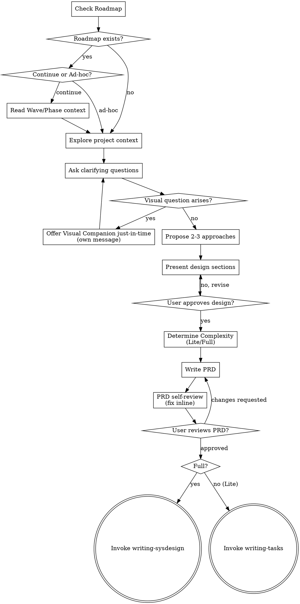

# Brainstorming Ideas Into PRDs

Help turn ideas into fully formed Product Requirements Documents (PRDs) through natural collaborative dialogue.

Start by checking the Roadmap context, then ask questions one at a time to refine the idea. Once you understand what you're building, present the design and produce a PRD.

<HARD-GATE>
Do NOT invoke any implementation skill, write any code, scaffold any project, or take any implementation action until you have presented a design and the user has approved it. This applies to EVERY project regardless of perceived simplicity.
</HARD-GATE>

## Anti-Pattern: "This Is Too Simple To Need A Design"

Every project goes through this process. A todo list, a single-function utility, a config change — all of them. "Simple" projects are where unexamined assumptions cause the most wasted work. The design can be short (a few sentences for truly simple projects), but you MUST present it and get approval.

## Checklist

You MUST create a task for each of these items and complete them in order:

1. **Check Roadmap context** — does a Roadmap exist? Determine if this is a Roadmap Phase or Ad-hoc Phase.
2. **Explore project context** — check files, docs, recent commits
3. **Offer the visual companion just-in-time** — NOT upfront. The first time a question would genuinely be clearer shown than described, offer it then (its own message); on approval its browser tab opens for you. If no visual question ever arises, never offer it. See the Visual Companion section below.
4. **Ask clarifying questions** — one at a time, understand purpose/constraints/success criteria
5. **Propose 2-3 approaches** — with trade-offs and your recommendation
6. **Present design** — in sections scaled to their complexity, get user approval after each section
7. **Determine Complexity** — Lite or Full? Recommend and get user confirmation
8. **Write PRD** — save to `docs/superpowers/specs/<phaseName>/prd.md` and commit
9. **PRD self-review** — quick inline check for placeholders, contradictions, ambiguity, scope (see below)
10. **User reviews written PRD** — ask user to review the PRD file before proceeding
11. **Transition** — Full → invoke `writing-sysdesign`; Lite → invoke `writing-tasks`

## Process Flow



## Step 0: Roadmap Check

Before anything else, check if a Roadmap exists at `docs/superpowers/roadmap.md`:

- **Exists:** Read the Roadmap and report current status. Then ask:
  > "Roadmap found. Current Wave: <Wave N>. Next Phase to work on: <Phase name> (Status: <status>).
  >  Continue from Roadmap, or start an ad-hoc Phase?"
  - **Continue:** Use the Wave/Phase Goal and Non-goals to constrain the brainstorming scope. The Phase folder name will follow Roadmap naming: `YYYY-MM-DD-w<N>-p<N>-<topic>`.
  - **Ad-hoc:** Run standard brainstorming. Folder name: `YYYY-MM-DD-<topic>`. Does not affect Roadmap.

- **Does not exist:** Proceed directly to exploration. No Roadmap required.

## The Process

**Understanding the idea:**

- Check out the current project state first (files, docs, recent commits)
- Before asking detailed questions, assess scope: if the request describes multiple independent subsystems (e.g., "build a platform with chat, file storage, billing, and analytics"), flag this immediately. Don't spend questions refining details of a project that needs to be decomposed first.
- If the project is too large for a single Phase, help the user decompose into sub-Phases: what are the independent pieces, how do they relate, what order should they be built? Then brainstorm the first Phase through the normal design flow. Each Phase gets its own PRD → SysDesign (if Full) → Tasks → Execute cycle.
- For appropriately-scoped Phases, ask questions one at a time to refine the idea
- Prefer multiple choice questions when possible, but open-ended is fine too
- Only one question per message - if a topic needs more exploration, break it into multiple questions
- Focus on understanding: purpose, constraints, success criteria

**Exploring approaches:**

- Propose 2-3 different approaches with trade-offs
- Present options conversationally with your recommendation and reasoning
- Lead with your recommended option and explain why

**Presenting the design:**

- Once you believe you understand what you're building, present the design
- Scale each section to its complexity: a few sentences if straightforward, up to 200-300 words if nuanced
- Ask after each section whether it looks right so far
- Cover: architecture, components, data flow, error handling, testing
- Be ready to go back and clarify if something doesn't make sense

**Design for isolation and clarity:**

- Break the system into smaller units that each have one clear purpose, communicate through well-defined interfaces, and can be understood and tested independently
- For each unit, you should be able to answer: what does it do, how do you use it, and what does it depend on?
- Can someone understand what a unit does without reading its internals? Can you change the internals without breaking consumers? If not, the boundaries need work.
- Smaller, well-bounded units are also easier for you to work with - you reason better about code you can hold in context at once, and your edits are more reliable when files are focused. When a file grows large, that's often a signal that it's doing too much.

**Working in existing codebases:**

- Explore the current structure before proposing changes. Follow existing patterns.
- Where existing code has problems that affect the work (e.g., a file that's grown too large, unclear boundaries, tangled responsibilities), include targeted improvements as part of the design - the way a good developer improves code they're working in.
- Don't propose unrelated refactoring. Stay focused on what serves the current goal.

## Complexity Determination (Lite vs Full)

After the user approves the design, determine whether this Phase needs a SysDesign document:

**Two signals — if EITHER is true, recommend Full:**
1. The Phase introduces new exported functions, API endpoints, or public interfaces
2. Two or more modules need to coordinate or interact

**If neither is true → recommend Lite.**

Present the recommendation with reasoning:
> "This Phase [introduces N new API endpoints / requires coordination between X and Y / is a single-file change with no new interfaces].
>  I recommend **Full / Lite**. Do you agree?"

Record the decision in the PRD's `Complexity` and `SysDesign Decision` fields.

**Do NOT default to Full "just in case."** Low-quality SysDesign (written to check a box) is worse than no SysDesign.

## After the Design

**PRD Output:**

Write the validated design as a PRD to `docs/superpowers/specs/<phaseName>/prd.md` using this template:

```markdown
# Phase: <Phase Name> — PRD

## Meta

- **Complexity:** Lite | Full
- **Complexity Reason:** <one sentence>
- **Roadmap Reference:** <roadmap.md Wave/Phase, or N/A for ad-hoc>
- **Date:** YYYY-MM-DD

---

## Goal

<One paragraph: what the world looks like when done. Describe the outcome, not the approach.>

## Non-Goals

- <What this Phase explicitly does NOT address>
- <Guardrails against over-engineering>

## User Stories

### US-1: <Story Title>

**As a** <role>  **I want** <capability>  **So that** <benefit>

**Acceptance Criteria (BDD — acceptance level, 1-3 per story):**
- Given <precondition> When <action> Then <expected result>

### US-2: <Story Title>

(Same format, list all stories)

## Constraints

- <Technical limitations, compatibility requirements, performance targets>

## Open Questions (if any)

- <Undecided items to resolve during SysDesign or Tasks stage>

---

## SysDesign Decision

> **Agent Assessment:** <Why Lite or Full, based on the two signals>
>
> **Human Decision:** Lite / Full
>
> - If **Full** → Produce `sysdesign.md` via `writing-sysdesign`
> - If **Lite** → Proceed directly to `tasks.md` via `writing-tasks`
```

Commit the PRD to git. If a Roadmap exists and this is a Roadmap Phase, auto-update the Phase's PRD path.

**PRD Self-Review:**
After writing the PRD, look at it with fresh eyes:

1. **Placeholder scan:** Any "TBD", "TODO", incomplete sections, or vague requirements? Fix them.
2. **Internal consistency:** Do any sections contradict each other? Does the architecture match the feature descriptions?
3. **Scope check:** Is this focused enough for a single Phase, or does it need decomposition?
4. **Ambiguity check:** Could any requirement be interpreted two different ways? If so, pick one and make it explicit.

Fix any issues inline. No need to re-review — just fix and move on.

**User Review Gate:**
After the self-review passes, ask the user to review the written PRD before proceeding:

> "PRD written and committed to `<path>`. Please review it and let me know if you want to make any changes before we proceed."

Wait for the user's response. If they request changes, make them and re-run the self-review. Only proceed once the user approves.

**Transition:**

- **Full** → Invoke `writing-sysdesign` to create the System Design document
- **Lite** → Invoke `writing-tasks` to create the implementation tasks

Do NOT invoke any other skill. Do NOT set up git worktrees here (that happens at Stage 3).

## Key Principles

- **One question at a time** - Don't overwhelm with multiple questions
- **Multiple choice preferred** - Easier to answer than open-ended when possible
- **YAGNI ruthlessly** - Remove unnecessary features from all designs
- **Explore alternatives** - Always propose 2-3 approaches before settling
- **Incremental validation** - Present design, get approval before moving on
- **Be flexible** - Go back and clarify when something doesn't make sense

## Visual Companion

A browser-based companion for showing mockups, diagrams, and visual options during brainstorming. Available as a tool — not a mode. Accepting the companion means it's available for questions that benefit from visual treatment; it does NOT mean every question goes through the browser.

**Offering the companion (just-in-time):** Do NOT offer it upfront. Wait until a question would genuinely be clearer shown than told — a real mockup / layout / diagram question, not merely a UI *topic*. The first time that happens, offer it then, as its own message:
> "This next part might be easier if I show you — I can put together mockups, diagrams, and comparisons in a browser tab as we go. It's still new and can be token-intensive. Want me to? I'll open it for you."

**This offer MUST be its own message.** Only the offer — no clarifying question, summary, or other content. Wait for the user's response. If they accept, start the server with `--open` so their browser opens to the first screen automatically. If they decline, continue text-only and don't offer again unless they raise it.

**Per-question decision:** Even after the user accepts, decide FOR EACH QUESTION whether to use the browser or the terminal. The test: **would the user understand this better by seeing it than reading it?**

- **Use the browser** for content that IS visual — mockups, wireframes, layout comparisons, architecture diagrams, side-by-side visual designs
- **Use the terminal** for content that is text — requirements questions, conceptual choices, tradeoff lists, A/B/C/D text options, scope decisions

A question about a UI topic is not automatically a visual question. "What does personality mean in this context?" is a conceptual question — use the terminal. "Which wizard layout works better?" is a visual question — use the browser.

If they agree to the companion, read the detailed guide before proceeding:
`skills/brainstorming/visual-companion.md`

## Related Skills

- `authoring-roadmap` — produces Roadmap that this skill reads at startup
- `writing-sysdesign` — next step for Full Phases (produces sysdesign.md)
- `writing-tasks` — next step for Lite Phases (produces tasks.md)
- `spec-scan` — validates PRD and other Phase documents
