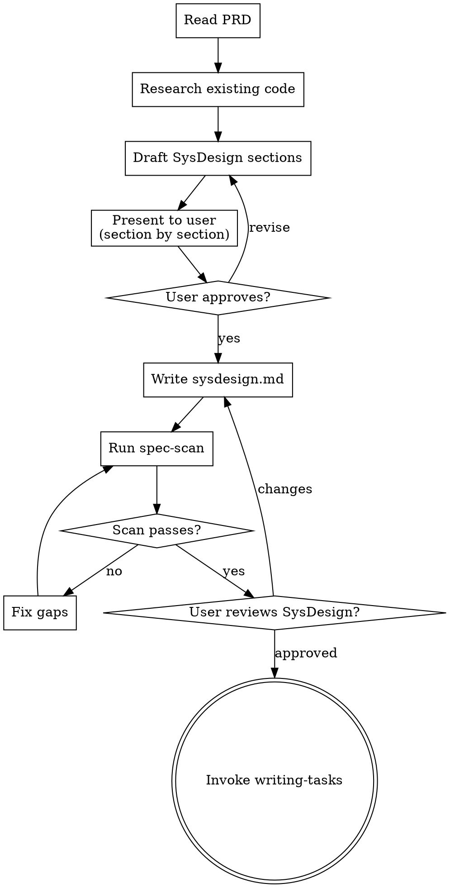

# Writing System Design Documents

## Overview

Transform an approved PRD into a structured System Design document that provides the technical blueprint for implementation.

Core principle: SysDesign bridges the gap between "what to build" (PRD) and "how to build it" (Tasks). It captures the technical decisions, interface contracts, and correctness constraints that the implementation must satisfy.

**Announce at start:** "I'm using the writing-sysdesign skill to create the System Design document."

## When to Use

- PRD has been approved with `Complexity: Full`
- The Phase introduces new exported functions, API endpoints, or public interfaces
- Two or more modules need to coordinate or interact

Do NOT use when:
- PRD has `Complexity: Lite` — go directly to `writing-tasks`
- The Phase is a single-file tweak with no new interfaces

## The Process



### Step 1: Read the PRD

Read `specs/<phaseName>/prd.md`. Extract:
- Goal and Non-goals (scope constraints)
- User Stories and acceptance BDD (requirements to satisfy)
- Constraints (technical boundaries)
- Open Questions (to resolve in this stage)

### Step 2: Research Existing Code

Explore the codebase to understand:
- Existing module boundaries and interfaces
- Data models and schemas already in place
- Patterns and conventions used in the project

### Step 3: Draft the 7 Sections

Present each section to the user for approval before writing the final document.

## SysDesign Template

Save to `docs/superpowers/specs/<phaseName>/sysdesign.md`:

```markdown
# Phase: <Phase Name> — System Design

## Meta

- **PRD Reference:** prd.md
- **Date:** YYYY-MM-DD

---

## 1. Architecture Overview

<2-3 sentences describing the technical approach. This is a technical decision, not a requirements restatement.>

## 2. Data Model / Schema

<DB schema, data structures, type definitions — whatever fits the project.>

## 3. Interface Definitions

For each module's exported functions:

### Module: <ModuleName>

**`functionName(param1: Type, param2: Type) → ReturnType`**
- **Purpose:** <one sentence>
- **Precondition:** <what must be true before calling>
- **Postcondition:** <what is guaranteed after calling>

(Repeat for all exported functions)

## 4. State Machine (if applicable)

List each state, transition conditions, and side effects. Remove this section if no state machine exists.

## 5. Correctness Properties (CP-xx)

Invariants that must hold for ALL valid inputs, not just happy paths.
Each CP must have a corresponding Property-Based Test (PBT) in the tasks.

- **CP-01:** <invariant statement>
- **CP-02:** <invariant statement>
- **CP-03:** <invariant statement>

## 6. Wiring Matrix

The source of truth for inter-module call relationships.

| Order | Caller | Method Called | Param Source | Output / Side Effect |
|:------|:-------|:-------------|:-------------|:--------------------|
| 1     | ...    | ...          | ...          | ...                 |

For event-triggered calls, use a separate table:

| Trigger Event | Caller | Method Called | Precondition |
|:------|:-------|:-------------|:-------------|
| ...   | ...    | ...          | ...          |

## 7. Latent vs Deterministic Tagging

Tag each computation step from the sections above:

| Step | Type | Rationale |
|:-----|:-----|:----------|
| ... | Deterministic | Fixed logic, must be explicit in code |
| ... | Latent | Requires model judgment |

Deterministic steps MUST NOT be left for Agent inference — they must be explicitly implemented in code.
```

### Writing CP-xx

Correctness Properties are the most important part of SysDesign. Guidelines:

- CPs are **invariants**, not test cases. They must hold for ALL valid inputs.
- Write them as universal statements: "For all X, if P then Q"
- Bad: `CP-01: Login should work` (vague, not an invariant)
- Good: `CP-01: After successful authentication, the session token must be valid for exactly TTL seconds and no longer`
- Each CP needs at least one PBT in the tasks to verify it

### Writing the Wiring Matrix

The Wiring Matrix captures HOW modules connect:

- One row per call relationship
- Include parameter sources (where data comes from)
- Include side effects (what changes in the system)
- Order matters — it shows the call chain sequence

### Latent vs Deterministic

This tagging prevents a critical failure mode: leaving deterministic logic to Agent inference.

- **Deterministic:** The step has one correct answer (e.g., "calculate hash", "validate schema", "route to handler"). Must be in code.
- **Latent:** The step requires judgment (e.g., "choose best error message", "suggest fix"). Can be left to Agent.

## After Writing

1. Commit the SysDesign document to git
2. If Roadmap exists, auto-update the Phase's SysDesign path
3. Run `spec-scan` on the Phase folder — loop until PASS
4. Ask user to review: "SysDesign written and committed to `<path>`. Please review before we proceed to writing tasks."
5. On approval, invoke `writing-tasks`

## Common Mistakes

| Mistake | Fix |
|:---|:---|
| Writing CPs as test cases instead of invariants | Rewrite as universal "for all X" statements |
| Missing preconditions on interface contracts | Every exported function needs precond/postcond |
| Wiring Matrix with gaps | Every inter-module call must have a row |
| Skipping Latent/Deterministic tagging | Tag every computation step |
| SysDesign that restates PRD requirements | SysDesign is HOW, not WHAT |

## Related Skills

- `brainstorming` — produces the PRD that this skill consumes
- `spec-scan` — validates SysDesign completeness
- `writing-tasks` — next step after SysDesign is approved
- `harness-engineering` — conceptual reference for Feedforward/Feedback/Wiring model
